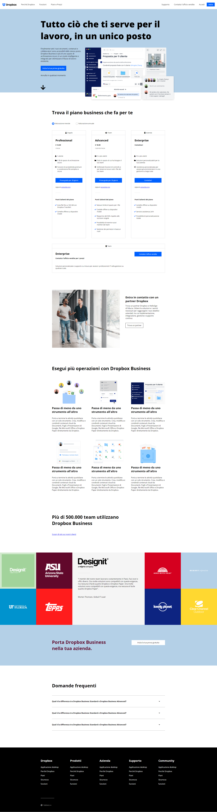

# DROPBOX

Questo progetto consiste nella riproduzione della Homepage di Dropbox di qualche anno fa ed è stato affidato agli studenti di Boolean, come esercizio da svolgere in tre giorni, al fine di applicare quanto imparato fin'ora. 
Di seguito riportiamo uno screen della pagina da riprodurre: 

